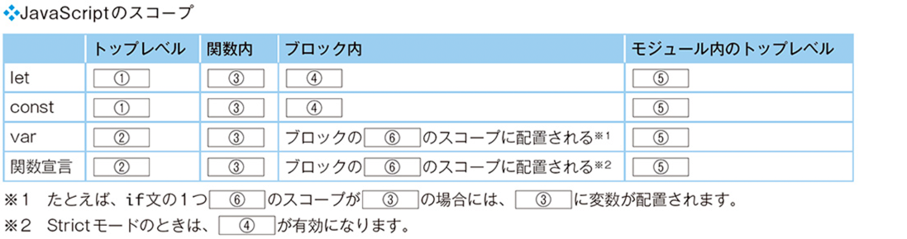

# 練習問題

## 練習問題7.1

［1］スコープとは何かを答えてください。

答え

> 実行中のコードから参照できる、変数や関数の範囲。

## 練習問題7.2

［1］次のコードの①～⑨の変数や関数がそれぞれどのスコープに属するか答えなさい。

```javascript
var a // ①
let b // ②
function fn1 () { // ③
	var c // ④
	let d // ⑤
	if (true) {
		var e // ⑥
		let f // ⑦
		function fn2 () {} // ⑧
	}
}
const fn3 = function () {} // ⑨
```

答え
> ① グローバルスコープ  
> ② スクリプトスコープ  
> ③ グローバルスコープ  
> ④ 関数スコープ  
> ⑤ 関数スコープ  
> ⑥ 関数スコープ  
> ⑦ ブロックスコープ  
> ⑧ 関数スコープ  
> ⑨ スクリプトスコープ

## 練習問題7.3

［1］レキシカルスコープとはどのようなスコープか答えてください。

実行中のコードから見た、外側のスコープのこと。

［2］次のようなコードを変更したときに、エラーが発生しました。エラーが発生した箇所と原因を答えてください。また、必要最低限の範囲にスコープを保つように、コードを修正してください。

```javascript
/* 修正前のコード */
let rand;
function chance () {
	rand = Math.random();
	if (rand < .5) {
		let result = "成功";
	} else {
		let result = "失敗";
	}
	return result;
}
console.log(chance());
```

答え

> エラーが発生した箇所
`return result`の箇所。

> 原因
`result`はif文の中のブロックスコープ内で定義されていて、ブロックスコープ外では参照できなかったため

```javascript
// 修正後のコード
function chance () {
	let rand = Math.random()
	let result
	if (rand < .5) {
		result = '成功'
	} else {
		result = '失敗'
	}
	return result
}
console.log(chance())
```

## この章の理解度チェック

［1］スコープの種類次の表の空欄を埋めて、文章を完成させてください。

① スクリプトスコープ  
② グローバルスコープ  
③ 関数スコープ  
④ ブロックスコープ  
⑤ モジュールスコープ  
⑥ 外側

［2］スコープの範囲次の①～⑦で変数valを参照しようとしたとき、"グローバル"、"関数内"
、エラーのいずれの結果となるか答えてください（②の場合は、関数fn1を実行しようとしたとき、実行できるかどうかを答えてください）。

なお、JavaScriptの場合は、エラーが発生した時点でコードの実行は終了するため、コメントアウトをうまく利用しながら、それぞれの挙動を確認しましょう。

```javascript
    let val = "グローバル";
function fn1 () {
	let val = "関数内";
	if (Math.random() < .5) {
		console.log(val); // ①
		fn1(); // ②
	}
	function fn2 () {
		console.log(val); // ③
	}
	console.log(val); // ④
	fn2();
	return val;
}
function fn3 () {
	console.log(val); // ⑤
}
console.log(val); // ⑥
const result = fn1();
console.log(result); // ⑦
fn3();
```

① 関数内  
② fn1はレキシカルスコープに位置するため、実行可能。
③ 関数内  
④ 関数内  
⑤ グローバル  
⑥ グローバル  
⑦ 関数内

［3］クロージャ

クロージャを使って、次の挙動を満たす関数（delayMessageFactory）を実装してみてください。

```javascript
const dialog = delayMessageFactory(alert, 2000);
dialog("こんにちは");
// ２秒後にアラートで「こんにちは」と表示されます。
const log = delayMessageFactory(console.log, 1000);
log("こんばんは");
// １秒後にコンソールに「こんばんは」と表示されます。
```

答え

```javascript
function delayMessageFactory (printFunc, ms) {
	return function (message) {
		setTimeout(() => {
			printFunc(message)
		}, ms)
	}
}
```

［4］クロージャを、アロー関数を使って簡略化

［3］で作成した関数（delayMessageFactory）を、アロー関数を使って省略して記述してみてください。

答え

```javascript
const delayMessageFactory = (printFunc, ms) => message => setTimeout(() => printFunc(message), ms)
```
